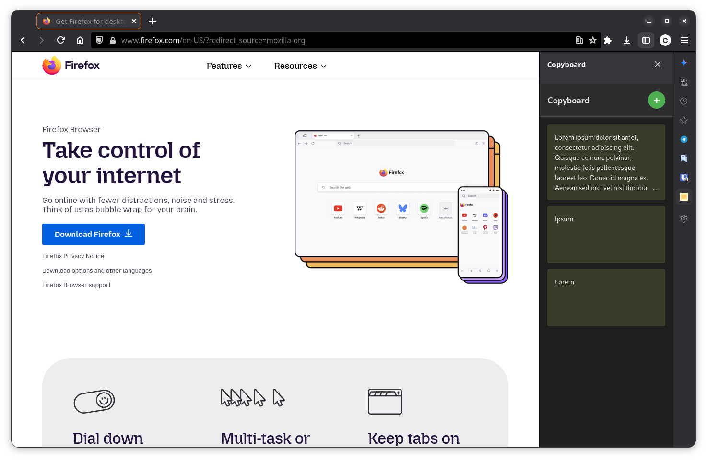

# Copyboard

A Firefox sidebar extension for managing quick notes in a post-it style interface.

> **Note**: This extension is designed specifically for Firefox and uses the sidebar API, which is not available in Chrome or other Chromium-based browsers.

## Features

- **Quick Notes**: Click the + button to add a new note instantly
- **Post-it Style**: Visual, card-based interface with a clean yellow post-it aesthetic
- **Copy to Clipboard**: Click any note to copy its contents to the clipboard
- **Edit Notes**: Click the pencil icon to edit a note (or use Ctrl+Enter to save, Esc to cancel)
- **Delete Notes**: Click the trash icon to delete a note (with confirmation)
- **Drag & Drop**: Reorder notes by dragging them
- **Persistent Storage**: Notes are automatically saved using Firefox's local storage
- **Dark Mode**: Automatic dark mode support based on browser/system preferences

## Installation

### From Source (Development)

1. Clone this repository or download the files
2. Open Firefox and navigate to `about:debugging#/runtime/this-firefox`
3. Click "Load Temporary Add-on"
4. Navigate to the extension directory and select the `manifest.json` file

### From Firefox Add-ons (AMO)

The extension will be available on [Firefox Add-ons](https://addons.mozilla.org/) once reviewed and published.

## Usage

1. Click the Copyboard icon in your browser toolbar to open the sidebar
2. Click the **+** button to create a new note
3. Type your note content
4. Click outside the note or press Ctrl+Enter to save
5. Click on any note to copy its contents to the clipboard
6. Hover over a note to see edit and delete buttons
7. Drag notes to reorder them

## Keyboard Shortcuts

- **Ctrl+Enter** (or **Cmd+Enter** on Mac): Save note while editing
- **Esc**: Cancel editing

## Technical Details

- **Browser**: Firefox only (uses Firefox-specific sidebar API)
- **Manifest Version**: 2 (Firefox WebExtensions API)
- **Minimum Firefox Version**: 58.0+
- **Permissions**:
  - `clipboardWrite`: To copy note contents to clipboard
  - `storage`: To save notes persistently
- **Technologies**: Vanilla JavaScript, HTML5, CSS3

## Development

The extension uses a simple architecture:

- `manifest.json`: Extension configuration
- `sidebar/sidebar.html`: Main UI structure
- `sidebar/sidebar.css`: Styling for post-it notes and interface (with dark mode support)
- `sidebar/sidebar.js`: All functionality (notes management, drag & drop, storage)
- `background.js`: Opens sidebar on toolbar button click
- `icons/`: Extension icons

## License

MIT License - Feel free to use and modify as needed.

## Contributing

Contributions are welcome! Please feel free to submit issues or pull requests.

## Roadmap

- [ ] Color coding for notes
- [ ] Search functionality
- [ ] Export/import notes
- [ ] Markdown support
- [ ] Keyboard shortcuts for creating notes
- [ ] Categories/tags
